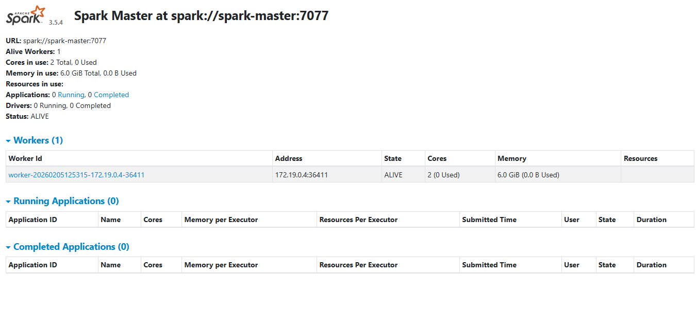

# Paso 2: Infraestructura Docker

**Alumno:** Fernando Ramos

---

## 2.1 Mi docker-compose.yml explicado

### Servicio: PostgreSQL

# PostgreSQL - Base de datos para almacenar resultados procesados
  postgres:
    image: postgres:15-alpine          # Imagen de Docker
    container_name: bigdata_postgres   # Nombre del contenedor en Docker    
    environment:                       # Variables de entorno
      POSTGRES_DB: bigdata             # Nombre de la base de datos
      POSTGRES_USER: spark_user #      # Nombre de usuario de la base de datos
      POSTGRES_PASSWORD: spark_password # Contraseña del usuario 
    ports:
      - "5432:5432"                    # Puerto de comunicacion con la base de datos para guardar o consultar los datos
    volumes:
      - F:/LABSTORAGE/postgres_data:/var/lib/postgresql/data
    healthcheck:                       # Comando que chequea que los contenedores estén operando debidamente.
      test: ["CMD-SHELL", "pg_isready -U spark_user -d bigdata"] 
      interval: 10s                    # Testea los contenedores cada 10 sg 
      timeout: 5s
      retries: 5                       # Espera hasta 5 intentos antes de informar del error
    networks:
      - spark-network
    restart: unless-stopped            # Docker levanta al contenedor en caso de caida, a no ser que el usuario lo pare.# Pega aqui la seccion de PostgreSQL de tu YAML
```


### Servicio: Spark Master

# Spark Master - Coordinador del cluster
  spark-master:
    image: apache/spark:3.5.4-python3
    container_name: spark_master        # Definicion de nombre del contenedor en Docker
    environment:
      - SPARK_MODE=master
      - SPARK_MASTER_HOST=spark-master  # Nombre del contenedor del Master
      - SPARK_MASTER_PORT=7077          # Puerto de comuniccion interna entre el master y los trabajadores.
      - SPARK_MASTER_WEBUI_PORT=8080    # Puerto de visualización. Maestro, trabajadores, memoria y nucleos destinados etc.
    ports:
      - "8080:8080"
      - "7077:7077"
    volumes:                            # Ruta de la base de datos a la cual están conectados los trabajadores y maestro.
      - F:/LABSTORAGE/data:/opt/spark/work-dir/data
      - F:/LABSTORAGE/spark_output:/opt/spark/work-dir/output
      - F:/LABSTORAGE/spark_logs:/opt/spark/work-dir/logs
    command: /opt/spark/bin/spark-class org.apache.spark.deploy.master.Master # Preparar el entorno y asignar el rol de maestro
    networks:
      - spark-network
    restart: unless-stopped             # Docker levanta al contenedor en caso de caida, a no ser que el usuario lo pare.


**Que hace:** El rol del maestro es coordinar e indicar las tareas a los trabajadores. Se comunican por el puerto 7077 de manera interna facilitando la comunicacion entre ellos evitando errores.


### Servicio: Spark Worker

# Spark Worker - Nodo de procesamiento
  spark-worker:
    image: apache/spark:3.5.4-python3
    container_name: spark_worker_1                 # Definicion de nombre del contenedor en Docker
    environment:
      - SPARK_MODE=worker
      - SPARK_MASTER_URL=spark://spark-master:7077 # URL del Master para conectarse a el.
      - SPARK_WORKER_CORES=2                       # Definicion de nucleos disponible para utilizar
      - SPARK_WORKER_MEMORY=6g                     # Definicion de memoria disponible para utilizar
    depends_on:
      - spark-master
    volumes:
      - F:/LABSTORAGE/data:/opt/spark/work-dir/data
      - F:/LABSTORAGE/spark_output:/opt/spark/work-dir/output
      - F:/LABSTORAGE/spark_logs:/opt/spark/work-dir/logs
    command: /opt/spark/bin/spark-class org.apache.spark.deploy.worker.Worker spark://spark-master:7077 --cores 2 --memory 6g
    networks:
      - spark-network
    restart: unless-stopped

networks:
  spark-network:
    driver: bridge

```

**Que hace:** Crea el contenedor del trabajador con especifcando su memoria y nucleos, al igual que define la ruta de conxion con el master por el puerto 7077.[Explica como el Worker se conecta al Master.
Que pasa si agregas mas Workers? Que recursos le asignaste?] En caso de requerir más memoria de la que el equipo puede ofrecer, docker fallara en la creacion de los workers al no poder destinar la memoria requerida.

---


## 2.2 Healthchecks

[Explica que son los healthchecks y por que los necesitas. Los healthcheck permiten ver si los contenedores están 
 operando debidamente. Se establece un tiempo de chequeo y numero de intentos antes de avisar al master de la caida.
Que pasa si PostgreSQL no tiene healthcheck y Spark intenta conectarse 
antes de que este listo?] Dará error hasta no tener la confirmación de la conexión.

---

## 2.3 Evidencia: Captura Spark UI



Vemos el entorno completo. Puerto de comunicacion interna entre el maestro y los trabajadores 7077, numero de trabajaodres activos con su ID, numero de nucleos y y meoriea destinados al cluster.

---

## 2.4 Prompts utilizados para la infraestructura

### Prompt 1 (el primero que usaste):

**Herramienta:** Claude 

**Tu prompt exacto:**
```
necesito crear un cluster distribuido con Spark y docker. genera un archivo .yml para Tengo un disco SSD externo de 250 GB en el puerto F: de mi ordenador. Mi equipo tiene 16 gb de ram y dos nucleos, quiero crear un maestro y dos trabajadores y mi base de datos esta en esta ruta F:\\LABSTORAGE\\data
     antes de escribir ningun codigo vamos a asegurarnos que esta toda la estructura y todo lo necesario preparado
```
**Que te devolvio (resumen en 2-3 lineas):**
```
Confirmó mi hardware e identificó dos problemas. Memoria y nucleos insuficientes para un cluster con dos trabajadores, y advertiencia de lentitud en el proceso con un disco externo. Propuso un solo trabajador al tener solo un nucleo. En cuanto al disco, me pregunto si era USB 3. 

** Claude: Preguntas que necesito que respondas

¿Tienes Docker Desktop instalado y configurado? (Sí/No)

¿Cuánta RAM has asignado a Docker Desktop en Settings?

¿El CSV del dataset QoG está ya en F:\LABSTORAGE\data? (Sí/No)

¿Prefieres Opción A (1 worker estable) u Opción B (2 workers distribuido real)?

¿Docker tiene acceso a la unidad F: en File Sharing? (Verifica en Docker Desktop → Settings → Resources → File Sharing)

Una vez que confirmes estos puntos, generaré el docker-compose.yml adaptado específicamente a tu hardware y estructura de carpetas. No voy a darte código genérico que luego falle por problemas de configuración.


**Que tuviste que cambiar de esa respuesta y por que:**

[Que partes NO funcionaron o tuviste que adaptar.
Si funciono todo a la primera, explicalo tambien.]

---

### Prompt 2 (si iteraste o pediste correccion):

**Herramienta:** Claude 

**Tu prompt exacto:**
```
Me parece bien. Vamos con untrabajador y vamos viendo
Tengo el ssd en un puerto usb 3
Tengo docker instalado y preparado Docker version 29.0.1, build eedd969
en docker no veo donde puedo confirmar la ram y cpu asignado
SI existe F: y el csv qog_std_ts_jan24 esta en esta ruta F:\\LABSTORAGE\\data
Vamos con la opcipn A
```

**Que te devolvio y que cambiaste:**

Confirmó positivamente el checklist de sus preguntas. 
Me propuso una estructura de carpetas en F: y me paso el codigo power shell con la creacion de las carpetas
Generó el archivo.yml. y vi que había cambiado una libreira por otra en el archivo .yml 

---

### Prompt 3 (si necesitaste mas iteraciones):

**Herramienta:** Claude 

**Tu prompt exacto:**

espera, estas proponiendo stack tecnologico diferente al que propone el profesor. es imprescindible? Tengo qu defender estos cambios de ser asi.

**Que te devolvio y que cambiaste:**

Me explicó los beneficios de usar Bitnami (más fácil para producción) en lugar de Apache Spark (menor configuracion manual, scripts de arranque, variables ENV complejas) y Workers no se conectan automáticamente (necesitas configurar SPARK_MASTER_URL + scripts adicionales)

Finalmente generó de nuevo el archivo .yml con Apache Spark diciendo que el profesor lo pide especificamente, que es la imagen de referencia académica y que cualquier recurso online usará esta. 


### Prompt 4 (si necesitaste mas iteraciones):

**Herramienta:** Claude 

**Tu prompt exacto:**

todo perfecto pero en docker los trabajadores no estan activos

**Que te devolvio y que cambiaste:**

Primero necesito ver los logs para diagnosticar el problema exacto.
Ejecuta los dos comandos de logs y pégame los outputs completos. Con eso identifico el problema real y te doy la solución específica.Pero primero necesito ver los logs para diagnosticar el problema exacto.

Yo: esta es la salida que me ha dado antes 
[+] Running 25/25
 ✔ spark-worker Pulled                                                                                                                            195.9s 
 ✔ spark-master Pulled                                                                                                                            196.9s 
 ✔ postgres Pulled                                                                                                                                135.5s 
[+] Running 4/4
 ✔ Network trabajo_final_spark-network  Created                                                                                                     2.3s 
 ✔ Container bigdata_postgres           Started                                                                                                    21.7s 
 ✔ Container spark_master               Started                                                                                                    31.0s 
 ✔ Container spark_worker_1             Started                                                                                                    41.6s 
(.venv) PS C:\\Users\\Tucanae Ramos\\PycharmProjects\\ejercicios-bigdata\\trabajo_final> 
(.venv) PS C:\\Users\\Tucanae Ramos\\PycharmProjects\\ejercicios-bigdata\\trabajo_final>

/opt/entrypoint.sh: line 128: /opt/spark/work-dir/bin/spark-class: No such file or directory

*** Claude *** Ahí está el problema. La imagen oficial de Apache Spark tiene una estructura de directorios diferente a la esperada.

Reemplaza tu docker-compose.yml con esta versión corregida
Ruta correcta del comando: command: /opt/spark/bin/spark-class org.apache.spark.deploy.master.Master
Worker con parámetros explícitos: command: /opt/spark/bin/spark-class org.apache.spark.deploy.worker.Worker spark://spark-master:7077 --cores 2 --memory 6g. Los flags --cores y --memory aseguran la asignación correcta.

Volúmenes mapeados a /opt/spark/work-dir/:
Esta es la ubicación esperada por la imagen oficial.
    


## 2.5 Recursos web consultados (si NO usaste IA)

Si en lugar de IA consultaste documentacion, tutoriales o videos:

| Recurso | URL | Que aprendiste de el |
|---------|-----|---------------------|
| | | |
| | | |
| | | |
