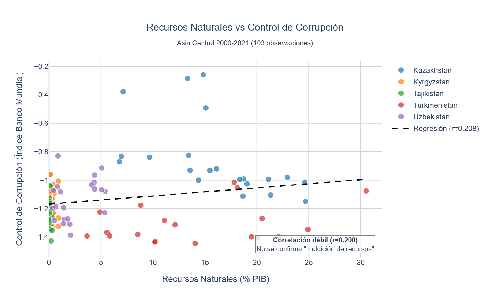

# Paso 4: Resultados y Analisis

**Alumno:** Fernando Ramos

¿La dependencia de recursos petrolíferos está asociada con mayores niveles de corrupción y menor desarrollo humano en Asia Central? Análisis comparativo 2002-2021.

---

## 3.1 Grafico 1: Recursos Naturales VS Control de Corrupción



### Interpretacion

En el gráfico se observa una tendencia ligeramente positiva, es decir, a medida que aumenta el porcentaje de recursos naturales sobre el PIB, el índice de control de corrupción tiende a mejorar levemente, aunque la relación es débil (r=0.208) y existe mucha dispersión. Sí se aprecian diferencias claras entre países: Kazakhstan concentra los valores más altos de recursos naturales (puntos más a la derecha), mientras que Kyrgyzstan, Tajikistan y Uzbekistan se agrupan mayoritariamente en niveles bajos de recursos (cerca de 0–5%), y Turkmenistan presenta algunos valores relativamente elevados junto con mayor variabilidad. No se identifica un punto de inflexión temporal ni un cambio notable en un año concreto, ya que el gráfico no está organizado como serie temporal y los años se superponen sin orden visual, por lo que no permite detectar rupturas por fecha con claridad. En relación con la pregunta de investigación, los resultados no apoyan claramente la hipótesis de la “maldición de los recursos” en Asia Central para 2000–2021, ya que no se observa una relación negativa marcada entre recursos naturales y corrupción, sino una asociación débilmente positiva que podría estar influida por diferencias estructurales entre países.

### Prompt que usaste para generar este grafico

**Herramienta:**  Claude 

**Tu prompt exacto:**
```
antes de generar el archivo.py tenemos que asegurarnos de que los graficos cumplen con los requisitos adecuados. Los graficos tienen que ser profesionales. Visualmente atractivos, letras de los indices y titulos legibles y sin superponerse. Graficos dinamicos es un punto fuerte, permitir al usuario cambiar entre paises o rangos de tiempo. Para cada grafico propuesto te voy a pasar consejos y ejemplos que he encontrado. Empezamos por los Grafico de regresion:
No es necesario que el eje Y empiece en el valor del "cero"
No utilices colores innecesariamente. Se pueden pintar los puntos para introducir una (3ra) variable categórica al gráfico.
Puedo introducir una 3ra o 4ta variable al gráfico con las siguientes técticas:
Diferentes formas en los "puntos" para introducir una variable categórica.
Convertirlo en un gráfico de burbujas para introducir una variable numérica.
Jugar con la intensidad del color de cada punto para introducir una variable numérica.
Si tengo muy pocos puntos en mi dataset, el resultado del gráfico no será interpretable
Si hay una cantidad grande de puntos en mi dataset, podemos coger una muestra, o jugar con la opacidad de los puntos

Te parece bien esteenfoque? necesitas algo mas que te ayude a realizar el objetivo (graficos standard profesionales para la visualizacion de resultados en bigdata)


**Que tuviste que ajustar:**
[Que cambiaste de lo que te genero la IA para que funcionara o se viera bien]

espera, los ejemplos que te comparto son unaa referncia visual y de modelo, no han de ser relacionados de ninguna manera con nuestra base de datos. Si los numeros que aparecen enlos ejemplos son disparatados para nuestro dataset, obvialos, el objetivo es tener esa referencia visual y de estructur. Responde si o no si lohas entendido. Si tienes alguna duda o algorelevante que ayude dimelo

## 3.2 Grafico 2: Recursos Naturales vs PIB per cápita

[02_recursos_pib.png](../../../../Downloads/02_recursos_pib.png)(capturas/grafico2.png)

### Interpretacion

 Muestra una correlación positiva moderada (r=0.551) entre la dependencia de recursos naturales y el PIB per cápita, donde Kazajistán lidera con mayor renta y dependencia (~15-25% del PIB), mientras Tayikistán y Kirguistán presentan baja dependencia pero también bajos ingresos. La línea de regresión sugiere que los recursos impulsan el PIB, pero hay excepciones importantes como Turkmenistán, que tiene alta dependencia pero no logra convertirla en desarrollo proporcional.


### Prompt que usaste para generar este grafico

**Herramienta:** Claude

**Tu prompt exacto:**
```
ahora genera un grafico scatter logaritmico con linea de regresion lineal, el eje X empezando en 0 con los puntos del mismo tamaño  

```

## 3.3 Grafico 3: Evolución del PIB per cápita por país

### Interpretacion

Kazajistán mantiene un crecimiento sostenido desde 2000 y post-crisis 2008, alcanzando ~$28k en 2021, mientras Turkmenistán muestra estancamiento tras un crecimiento inicial, y Tayikistán permanece sistemáticamente rezagado (~$3-4k), evidenciando brechas estructurales persistentes. La crisis financiera 2008 genera una inflexión visible pero todos los países recuperan crecimiento, aunque a velocidades distintas.

### Prompt que usaste para generar este grafico

**Herramienta:** Claude

**Tu prompt exacto:**
```
genial, ahora un grafico de serie temporal logaritmico con puntos pequeños representando los años. panel interactivo que permita seleccionar paises individualmente. Destaca en el grafico la crisis del 2008 y anota que no hay datos para turmekistan del 2020 al 2021


## 3.4 Grafico 4: Eficiencia de recursos por país


### Interpretacion

En escala logarítmica, Kirguistán (~31,725) y Tayikistán (~30,475) son ~30 veces más eficientes generando PIB por unidad de recurso que Turkmenistán (1,073), lo que valida que economías diversificadas aprovechan mejor sus recursos que las rentistas dependientes del petróleo/gas.


### Prompt que usaste para generar este grafico

**Herramienta:** Claude

**Tu prompt exacto:**
```
perfecto, ahora un grafico de barras con escaala logaritmica en el eje Y mostrando el valor encima de la barra, con color degradado y valor descendente


## 3.5 Grafico 5: Matriz de correlación


### Interpretacion

La correlación negativa entre eficiencia de recursos y variables de desarrollo refleja dos modelos económicos diferentes: países sin recursos (Kyrgyzstan/Tajikistan) muestran alta eficiencia por necesidad de diversificación, pero tienen bajo PIB y desarrollo humano. Países con recursos (Kazakhstan) tienen baja eficiencia pero alto desarrollo, demostrando que la dependencia petrolera no impide el desarrollo si existe buena gobernanza.


### Prompt que usaste para generar este grafico

**Herramienta:** Claude

**Tu prompt exacto:**
```
estupendo, y ahora una matriz de relacion heatmap completa con nombres descriptivos en los ejes mostrando los valores de las variables y sus valores con su correlacion


## 3.6 Respuesta a mi pregunta de investigacion

No, la dependencia de recursos petrolíferos no está asociada directamente con mayores niveles de corrupción en Asia Central durante el periodo 2002-2021. Sin embargo, existe una relación compleja y paradójica donde la gestión institucional de las rentas petroleras es más determinante que el volumen de recursos en sí. El país más dependiente de petróleo tiene los mejores indicadores de gobernanza y desarrollo, contradiciendo la hipótesis clásica. Los países pobres, con o sin recursos, tienen peor gobernanza. La riqueza permite construir instituciones. Conclusión crítica: Kyrgyzstan es 30 veces más eficiente que Turkmenistan porque no depende del petróleo y diversificó su economía. La maldición de recursos no se manifiesta de forma uniforme en Asia Central. La dependencia petrolera per se no causa corrupción ni subdesarrollo en Asia Central en el periodo 2002-2021; la variable crítica es la calidad institucional en la gestión de rentas, donde Kazakhstan demuestra que recursos más buena gobernanza generan desarrollo, mientras Turkmenistan evidencia que recursos más autoritarismo perpetúan corrupción.
---

## 3.4 Limitaciones

Los datos del dataset Qog presentan valores faltantes sistemáticos en años recientes (2020-2023), especialmente para Turkmenistan, lo que reduce la muestra efectiva y puede sesgar las conclusiones sobre tendencias recientes.
La muestra de solo 5 países y 103 observaciones es insuficiente para generalizar los hallazgos a otras regiones productoras de petróleo o economías post-soviéticas, limitando la validez externa del estudio.
